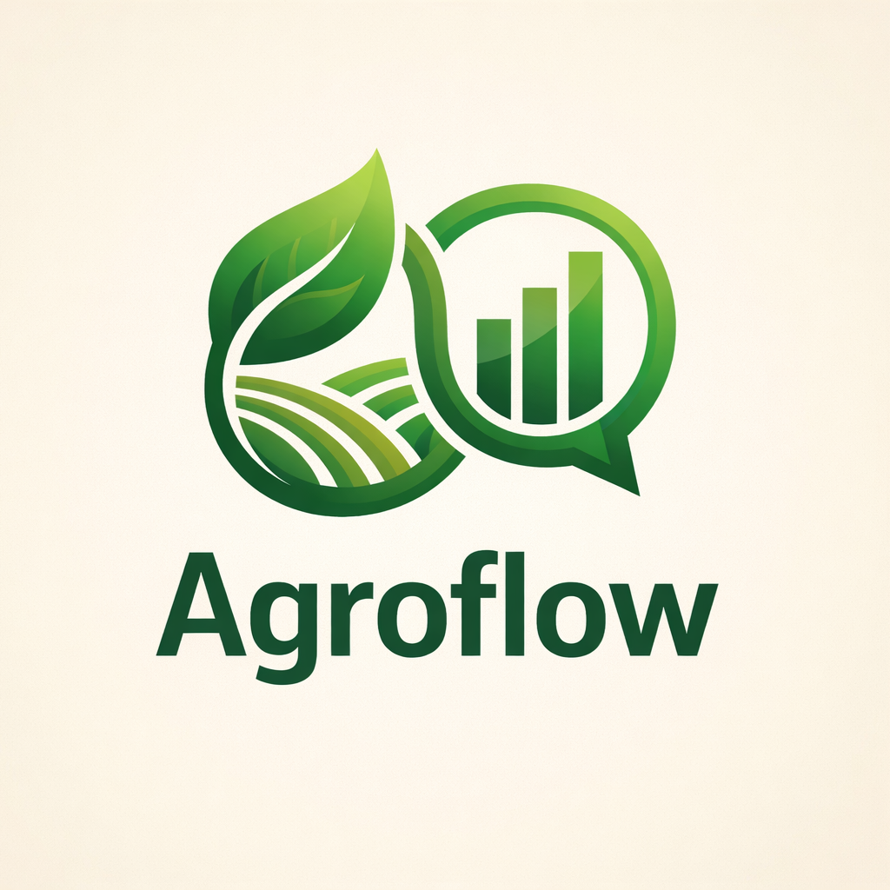

<p align="center">
  
</p>

<h1 align="center">Agroflow 🌾</h1>

<p align="center">
  <strong>Smart Agriculture Platform with IoT Monitoring, Blockchain NFT Traceability & AI-Powered Insights</strong>
</p>

<p align="center">
  <a href="https://agroflow-ivory.vercel.app/" target="_blank"></a>
</p>

<p align="center">
  <a href="#about">About</a> •
  <a href="#features">Features</a> •
  <a href="#live-demo">Demo</a> •
  <a href="#tech-stack">Tech Stack</a> •
  <a href="#getting-started">Setup</a> •
  <a href="#blockchain">Blockchain</a> •
  <a href="#api-reference">API</a>
</p>

<p align="center">
  
  
  
  
  
  <a href="https://agroflow-ivory.vercel.app/"></a>
</p>

---

## 📋 About

**Agroflow** is a comprehensive smart agriculture platform that bridges the gap between traditional farming and modern technology. It combines **IoT sensor monitoring**, **blockchain-based traceability**, and **AI-powered recommendations** to help farmers optimize their operations while providing consumers with transparent, verifiable information about their food's origin.

### 🎯 The Problem We Solve

1. **Lack of Transparency** – Consumers have no way to verify if produce is truly organic or where it came from
2. **Manual Monitoring** – Farmers manually check soil/weather conditions, leading to inefficiencies
3. **Food Fraud** – Fake organic labels and untraceable supply chains erode consumer trust
4. **Data Silos** – Farming data isn't leveraged for intelligent decision-making

### 💡 Our Solution

Agroflow provides an **end-to-end platform** that:

- 📡 **Monitors farms in real-time** using ESP32 IoT sensors (temperature, humidity, soil moisture)
- 🔗 **Creates immutable blockchain records** for every harvest batch as NFTs on Polygon
- 📱 **Enables consumer verification** by scanning QR codes to see the complete journey of their food
- 🤖 **Delivers AI-powered insights** via a multilingual chatbot (8+ Indian languages)
- 💧 **Automates irrigation** based on soil moisture thresholds

---

## ✨ Features

### 🌡️ Real-Time IoT Monitoring
- Live sensor data from ESP32 devices (DHT22 + Soil Moisture)
- Beautiful dashboard with trend charts and analytics
- Automatic data logging to Supabase every 30 seconds
- Alert system for critical conditions (low moisture, high temperature)

### 🔗 Blockchain Traceability (NFT Certificates)
- **Mint harvest batches as ERC-721 NFTs** on Polygon Amoy
- Each batch gets a unique **QR code** for product packaging
- Consumers can scan QR codes to verify authenticity on-chain
- Immutable record of: crop type, planting date, farm location, organic status
- Real MetaMask integration for signing blockchain transactions

### 🤖 AI-Powered AgriBot
- Smart farming assistant powered by **Google Gemini 2.5 Flash**
- Supports **8+ Indian languages**: Hindi, Tamil, Telugu, Kannada, Malayalam, Bengali, Marathi, Gujarati
- Context-aware answers using real sensor data from your farm
- Intelligent fallback responses when API is unavailable
- Voice-like conversational interface

### 💧 Smart Irrigation Control
- Automatic pump activation when soil moisture drops below threshold
- Manual override from the dashboard
- Irrigation history and water usage logs
- Configurable thresholds per zone

### 📱 Additional Features
- **Weather Forecasting** – 3-day forecast with farming recommendations
- **Crop Recommendations** – AI-suggested crops based on current conditions
- **Multi-Zone Support** – Manage different areas of your farm
- **Mobile-Responsive Design** – Full functionality on all devices
- **Dark Mode** – Easy on the eyes for night monitoring

---

## 🛠️ Tech Stack

| Category | Technology |
|----------|------------|
| **Frontend** | Next.js 15, React 19, TailwindCSS, Shadcn UI, Framer Motion |
| **Backend** | Next.js API Routes, Supabase (PostgreSQL + RLS) |
| **Blockchain** | Polygon Amoy Testnet, Solidity 0.8.20, ethers.js v6, MetaMask |
| **Smart Contract** | ERC-721 (OpenZeppelin), Hardhat |
| **AI/ML** | Google Gemini 2.5 Flash API |
| **IoT** | ESP32 DevKit, DHT22 Sensor, Capacitive Soil Moisture Sensor |
| **Charts** | Recharts |
| **QR Codes** | qrcode (npm), browser-native scanning |

---

## 🚀 Getting Started

### Prerequisites

- **Node.js 18+** and npm
- **Supabase account** (free tier works)
- **Google Gemini API key** (free tier: 15 RPM)
- **MetaMask wallet** (for blockchain features)
- **ESP32 + Sensors** (optional, for IoT features)

### Quick Installation

```bash
# Clone the repository
git clone https://github.com/Devvaibhavpk/Agroflow.git
cd Agroflow

# Install dependencies
npm install

# Copy environment template
cp .env.local.example .env.local

# Start development server
npm run dev
```

Open [http://localhost:3000](http://localhost:3000) 🎉

### Environment Variables

Create `.env.local` with these values:

```bash
# ─────────────────────────────────────────
# REQUIRED
# ─────────────────────────────────────────

# Supabase Database
NEXT_PUBLIC_SUPABASE_URL=https://your-project.supabase.co
NEXT_PUBLIC_SUPABASE_ANON_KEY=your_anon_key_here

# Google Gemini AI (for chatbot)
GEMINI_API_KEY=your_gemini_api_key

# ─────────────────────────────────────────
# BLOCKCHAIN (Pre-configured for demo)
# ─────────────────────────────────────────

NEXT_PUBLIC_NFT_CONTRACT_ADDRESS=0x8e205B621E7D122C8B1FD2695080A5Ea31280709
NEXT_PUBLIC_POLYGON_RPC_URL=https://rpc-amoy.polygon.technology
NEXT_PUBLIC_CHAIN_ID=80002
```

### Database Setup

Run these SQL scripts in **Supabase SQL Editor** (in order):

1. **`supabase/setup.sql`** – Core tables (sensor_data, zones, users)
2. **`supabase/blockchain_tables.sql`** – Harvest batches, blockchain logs
3. **`supabase/fix_rls.sql`** – Relaxed RLS for demo mode ⚠️
4. **`supabase/sample_data.sql`** – Optional demo data

---

## 🔗 Blockchain

### Deployed Smart Contract

The AgroflowNFT contract is **live on Polygon Amoy Testnet**:

| Property | Value |
|----------|-------|
| **Contract Address** | `0x8e205B621E7D122C8B1FD2695080A5Ea31280709` |
| **Network** | Polygon Amoy (Chain ID: 80002) |
| **Token Symbol** | AGRO |
| **Token Standard** | ERC-721 |
| **Explorer** | [View on PolygonScan](https://amoy.polygonscan.com/address/0x8e205B621E7D122C8B1FD2695080A5Ea31280709) |

### How NFT Traceability Works

```
┌─────────────┐    ┌─────────────┐    ┌─────────────┐    ┌─────────────┐
│  1. Create  │ →  │ 2. Generate │ →  │  3. Mint    │ →  │  4. Verify  │
│   Batch     │    │   QR Code   │    │    NFT      │    │  on Chain   │
└─────────────┘    └─────────────┘    └─────────────┘    └─────────────┘
    Farmer logs        Unique ID          MetaMask          Consumer
    harvest data       assigned          signs tx           scans QR
```

### Smart Contract Functions

```solidity
// Mint a new harvest batch NFT
function mintBatch(address to, string qrCodeId, bytes32 dataHash, string uri) → uint256

// Look up token by QR code
function getTokenByQrCode(string qrCodeId) → uint256

// Verify data integrity
function verifyIntegrity(uint256 tokenId, bytes32 dataHash) → bool

// Get batch details
function getBatchInfo(uint256 tokenId) → (owner, qrCodeId, dataHash, uri)
```

### Deploy Your Own Contract

See `contracts/DEPLOYMENT.md` for step-by-step instructions using Hardhat or Remix.

---

## 📡 API Reference

### Core Endpoints

| Endpoint | Method | Description |
|----------|--------|-------------|
| `/api/ask` | POST | AI chatbot with multilingual support |
| `/api/harvest` | GET | Fetch all harvest batches |
| `/api/harvest` | POST | Create new harvest batch |
| `/api/harvest` | PUT | Update batch / Mint as NFT |
| `/api/verify?qr_code_id=XX` | GET | Public verification endpoint |
| `/api/weather` | GET | Weather forecast data |
| `/api/recommendations` | GET | AI crop recommendations |
| `/api/nft-metadata/[qrCodeId]` | GET | NFT metadata (for OpenSea) |

### Example: AI Chatbot

```bash
curl -X POST http://localhost:3000/api/ask \
  -H "Content-Type: application/json" \
  -d '{
    "question": "मेरी फसल के लिए सबसे अच्छा समय क्या है?",
    "language": "hindi"
  }'
```

### Example: Create Batch

```bash
curl -X POST http://localhost:3000/api/harvest \
  -H "Content-Type: application/json" \
  -d '{
    "cropName": "Tomato",
    "cropVariety": "Roma",
    "plantingDate": "2026-01-15",
    "farmLocation": "Chennai, Tamil Nadu",
    "isOrganic": true
  }'
```

---

## 🔌 ESP32 IoT Setup

### Hardware Required

| Component | Purpose | GPIO |
|-----------|---------|------|
| ESP32 DevKit | Main controller | - |
| DHT22 | Temperature & Humidity | GPIO 4 |
| Soil Moisture Sensor | Soil monitoring | GPIO 34 (ADC) |
| 5V Relay Module | Pump control | GPIO 26 |
| Water Pump | Irrigation | Via Relay |

### Wiring Diagram

```
ESP32                    Sensors
─────                    ───────
GPIO 4  ──────────────── DHT22 Data
GPIO 34 ──────────────── Moisture Sensor (Analog)
GPIO 26 ──────────────── Relay IN (Pump Control)
3.3V    ──────────────── DHT22 VCC
5V      ──────────────── Relay VCC, Moisture VCC
GND     ──────────────── All GND
```

### Firmware Setup

1. Open `esp32/agroflow_firmware.ino` in Arduino IDE
2. Install required libraries: `DHT sensor library`, `ArduinoJson`, `WiFi`
3. Update credentials:
   ```cpp
   const char* ssid = "YOUR_WIFI_SSID";
   const char* password = "YOUR_WIFI_PASSWORD";
   const char* supabaseUrl = "https://your-project.supabase.co";
   const char* supabaseKey = "your_anon_key";
   ```
4. Upload to ESP32
5. Open Serial Monitor (115200 baud) to verify connection

See `esp32/README.md` for detailed troubleshooting.

---

## 📁 Project Structure

```
Agroflow/
├── app/                      # Next.js App Router
│   ├── api/                  # API Routes
│   │   ├── ask/              # AI Chatbot
│   │   ├── harvest/          # Batch CRUD
│   │   ├── verify/           # Public verification
│   │   └── nft-metadata/     # NFT metadata endpoint
│   ├── dashboard/            # Main monitoring dashboard
│   ├── traceability/         # NFT minting interface
│   ├── verify/[qrCodeId]/    # Consumer verification page
│   ├── chatbot/              # AI assistant page
│   ├── settings/             # User preferences
│   ├── docs/                 # Documentation
│   └── about/                # About page
├── components/               # React components
│   ├── WalletConnect.tsx     # MetaMask integration
│   └── ui/                   # Shadcn UI components
├── contracts/                # Solidity smart contracts
│   ├── src/AgroflowNFT.sol   # Main ERC-721 contract
│   ├── scripts/deploy.js     # Hardhat deploy script
│   └── DEPLOYMENT.md         # Deployment guide
├── esp32/                    # ESP32 Arduino firmware
│   ├── agroflow_firmware.ino # Main firmware
│   └── README.md             # Hardware setup guide
├── lib/                      # Utility libraries
│   ├── wallet.ts             # MetaMask/blockchain utils
│   ├── supabase.ts           # Database client
│   └── blockchain.ts         # Hash functions
├── supabase/                 # Database scripts
│   ├── setup.sql             # Core tables
│   ├── blockchain_tables.sql # NFT tables
│   ├── fix_rls.sql           # RLS policies
│   └── sample_data.sql       # Demo data
└── public/                   # Static assets
```

---

## 🎥 Demo

### 🌐 Live Deployment

**The application is live at: [https://agroflow-ivory.vercel.app/](https://agroflow-ivory.vercel.app/)**

### Live Pages

| Page | Description | Link |
|------|-------------|------|
| `/` | Landing page with feature overview | [Visit](https://agroflow-ivory.vercel.app/) |
| `/dashboard` | Real-time sensor monitoring | [Visit](https://agroflow-ivory.vercel.app/dashboard) |
| `/traceability` | Create batches & mint NFTs | [Visit](https://agroflow-ivory.vercel.app/traceability) |
| `/chatbot` | AI farming assistant | [Visit](https://agroflow-ivory.vercel.app/chatbot) |
| `/verify/[qrCodeId]` | Consumer verification | [Visit](https://agroflow-ivory.vercel.app/verify/demo) |
| `/docs` | API documentation | [Visit](https://agroflow-ivory.vercel.app/docs) |

### Test NFT Minting

1. Get test MATIC from [Polygon Faucet](https://faucet.polygon.technology/)
2. Connect MetaMask to Polygon Amoy
3. Go to [Traceability Page](https://agroflow-ivory.vercel.app/traceability) → Create batch → Mint NFT
4. View your NFT on [PolygonScan](https://amoy.polygonscan.com/address/0x8e205B621E7D122C8B1FD2695080A5Ea31280709#tokentxnsErc721)

---

## 🤝 Contributing

We welcome contributions! Here's how:

1. **Fork** the repository
2. **Create** a feature branch: `git checkout -b feature/amazing-feature`
3. **Commit** your changes: `git commit -m 'Add amazing feature'`
4. **Push** to branch: `git push origin feature/amazing-feature`
5. **Open** a Pull Request

---

## 📄 License

This project is licensed under the **MIT License** – see [LICENSE](LICENSE) for details.

---

## 👥 Team

Built with ❤️ for sustainable agriculture and transparent food supply chains.

**Repository**: [github.com/Devvaibhavpk/Agroflow](https://github.com/Devvaibhavpk/Agroflow)

---

<p align="center">
  <strong>🌱 Empowering Farmers • Connecting Consumers • Securing the Food Chain 🌱</strong>
</p>
